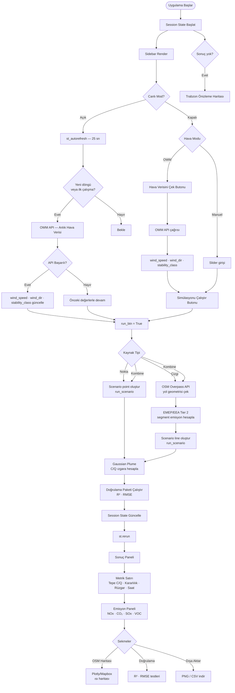

# 🏭 Gaussian Plume — Trabzon Hava Kalitesi Simülasyonu

Trabzon şehir merkezi için gerçek zamanlı hava kirliliği dağılımı simülasyonu.  
Gaussian plume modeli, OpenStreetMap yol ağı ve OpenWeatherMap anlık hava verisiyle çalışır.

---

## Özellikler

| Özellik | Detay |
|---|---|
| **Nokta Kaynak** | Tek bacadan yayılan kirleticinin Gaussian dağılımı |
| **Çizgi Kaynak** | Trabzon yol ağından EMEP/EEA Tier 2 emisyon faktörleriyle trafik kaynaklı kirlilik |
| **Kombine Mod** | Nokta + çizgi kaynak süperpozisyonu |
| **Canlı Mod** | OWM API'den 25 saniyede bir anlık rüzgar verisi çekip otomatik yenileme |
| **Emisyon Paneli** | NOx · CO₂ · SOx · VOC anlık değerleri (g/s) |
| **OSM Harita** | Plotly/Mapbox üzerinde interaktif konsantrasyon ısı haritası |
| **Dışa Aktarma** | PNG ve CSV export |
| **Doğrulama** | Analitik çözüme karşı model doğrulama paketi |

---

## Bilimsel Arka Plan

### Gaussian Plume Modeli

```
C(x,y,z) / Q = [exp(-y²/2σy²) · (exp(-(z-H)²/2σz²) + exp(-(z+H)²/2σz²))] / (2π · u · σy · σz)
```

- **C/Q** — normalize konsantrasyon (s/m³)  
- **σy, σz** — yatay / dikey dağılım katsayıları (Pasquill-Gifford-Briggs)  
- **H** — efektif baca yüksekliği (mekanik + termal yükselim dahil)  
- **u** — rüzgar hızı (m/s)

### Pasquill-Gifford Kararlılık Sınıfları

| Sınıf | Tanım | Durum |
|---|---|---|
| A | Very Unstable | Güneşli, düşük rüzgar |
| B | Unstable | Güneşli, orta rüzgar |
| C | Slightly Unstable | Kısmen bulutlu |
| D | Neutral | Bulutlu veya gece |
| E | Slightly Stable | Az bulutlu gece |
| F | Stable | Sakin, açık gece |

### EMEP/EEA Tier 2 Emisyon Faktörleri

| Yol Sınıfı | NOx (g/araç-km) | CO₂ (g/araç-km) |
|---|---|---|
| Motorway | 0.45 | 180 |
| Primary | 0.55 | 165 |
| Secondary | 0.60 | 160 |
| Residential | 0.70 | 150 |

---

## Teknoloji Yığını

```
Frontend  │ Streamlit · Plotly/Mapbox · streamlit-autorefresh
Backend   │ Python 3.10 · NumPy · SciPy
Veri      │ OpenWeatherMap API · Overpass API (OpenStreetMap)
Container │ Docker · Kubernetes (Docker Desktop)
CI/CD     │ Gitea Actions · Trivy
Monitoring│ Prometheus · Grafana · Loki · Promtail
```

---

## Hızlı Başlangıç

### Yerel Çalıştırma

```bash
# Bağımlılıkları yükle
pip install -r requirements.txt

# API anahtarını ayarla
export OWM_API_KEY="your_openweathermap_api_key"

# Uygulamayı başlat
streamlit run app.py
```

`http://localhost:8501` adresinden erişilebilir.

### Docker ile Çalıştırma

```bash
# Image oluştur
docker build -t gaussian-plume-trabzon:latest .

# Container başlat
docker run -d \
  -p 8501:8501 \
  -e OWM_API_KEY="your_key" \
  gaussian-plume-trabzon:latest
```

### Kubernetes (Production)

```bash
# Namespace ve secret oluştur
kubectl create namespace gaussian-plume
kubectl create secret generic owm-api-key \
  --from-literal=OWM_API_KEY=your_key \
  --namespace gaussian-plume

# Deploy et
kubectl apply -f k8s/deployment.yaml
kubectl apply -f k8s/service.yaml

# Port-forward ile eriş (kind cluster'da NodePort çalışmaz)
kubectl port-forward -n gaussian-plume svc/gaussian-plume 8501:8501 &
```

`http://localhost:8501` adresinden erişilebilir.

---

## Yapılandırma

| Ortam Değişkeni | Varsayılan | Açıklama |
|---|---|---|
| `OWM_API_KEY` | — | OpenWeatherMap API anahtarı (zorunlu) |
| `STREAMLIT_SERVER_PORT` | `8501` | Uygulama portu |
| `MPLBACKEND` | `Agg` | Matplotlib headless backend |

OWM API anahtarı için: [openweathermap.org/api](https://openweathermap.org/api) — ücretsiz plan yeterlidir.

---

## Proje Yapısı

```
gaussian_plume_trabzon/
├── app.py              # Streamlit arayüzü, canlı mod, oturum yönetimi
├── model.py            # Gaussian plume denklemi, σy/σz katsayıları
├── sources.py          # Overpass API yol geometrisi, EMEP/EEA emisyon faktörleri
├── scenarios.py        # Senaryo tanımları ve çalıştırma mantığı
├── validation.py       # Analitik doğrulama paketi
├── visualization.py    # Plotly/Mapbox ısı haritası ve OSM katmanı
├── api_module.py       # OWM API istemcisi
├── main.py             # CLI girişi
├── Dockerfile          # Container tanımı
├── requirements.txt    # Python bağımlılıkları
├── k8s/
│   ├── deployment.yaml # Kubernetes Deployment
│   ├── service.yaml    # NodePort Service
│   ├── rbac.yaml       # Runner için ServiceAccount + Role
│   └── gitea-runner.yaml
└── .gitea/workflows/
    └── ci.yml          # CI/CD pipeline (build → trivy → push → deploy)
```

---

## CI/CD Pipeline

```
git push → master
    │
    ├─► Docker image build   (commit SHA tag + latest)
    ├─► Trivy güvenlik taraması  (vuln + secret + misconfig)
    ├─► Registry push        (localhost:5000)
    └─► kubectl rollout restart  (sıfır kesinti)
```

---

## Mimari

```
┌─────────────────────────────────────────────────────┐
│                  Docker Desktop                      │
│                                                      │
│  Gitea :30880 ──► Actions Runner ──► local-registry  │
│       (Git + CI)    (Trivy scan)       :5000         │
│                          │                           │
│                          ▼ kubectl rollout restart   │
│  ┌──────────────────────────────────────────────┐   │
│  │          Kubernetes Cluster                   │   │
│  │                                               │   │
│  │  gaussian-plume  [pod1][pod2]  →:8501          │   │
│  │  monitoring      [prometheus]  :30090         │   │
│  │                  [grafana]     :30300         │   │
│  │                  [loki]                       │   │
│  │                  [promtail] ──► loki          │   │
│  └──────────────────────────────────────────────┘   │
└─────────────────────────────────────────────────────┘
```

---

## Program Akış Şeması



---

## Servisler

| Servis | Adres |
|---|---|
| Gaussian Plume App | http://localhost:8501 |
| Gitea | http://localhost:30880 |
| Grafana | http://localhost:3000 |
| Prometheus | http://localhost:9090 |
| Docker Registry | http://localhost:5000 |
